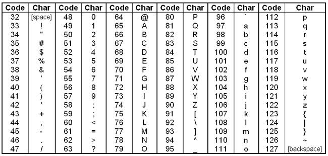

# <a name="Top" />Cracking the Coding Interview Personal Solutions

The purpose of this guide is to provide in depth explainations to the solutions in the book: Cracking the Coding Interview 6th Edition by Gayle Laakmann McDowell.

## Contents
* [Chapter 1 - String and Arrays](#Chapter1)
  * [Problem 1.1 - Is Unique](#Q1.1)
  * [Problem 1.2 - Check Permutation](#Q1.2)
  * [Problem 1.3 - URLify](#Q1.3)

<br/>
<br/>
<br/>

<h1 align="center" a name="Chapter1" />Chapter 1 - String and Arrays</h1> 

<br/>

## <a name="Q1.1" />Problem 1.1 - Is Unique
#### Implement an algorithm to determine if a string has all unique characters. What if you cannot use additional data structures?
* isUnique("water") -> true
* isUnique("hello") -> false
* isUnique("telephone") -> false

One way to approach this problem is to use ASCII code. See below:



Becuase each character has an assigned integer value, we can make an array of size 128 (indexes 0-127) to represent each character in the english langauge. For example, 'a' = 97, 'b' = 98, and 'c' = 99. This means array['a'] == array[97]. 

```java
//Program that prints: "Hello World!"
public static void main(String args[]) {

  String[] array = new String[128];
  array[97] = "Hello World!";
  System.out.println(array['a']);   

}
```

We will initialize all 128 values in our array to be false. This represents: "No, I have not seen this character yet". Since we are using 128 "blocks" of space, this simplifies down to O(1) space complexity becuase all constants are O(1) complexity. If we allocated a new data structure, we would have to use O(N) space because the input string might contain >100 million characters! 

Now all we need to do is loop through the input string. Everytime we see a unique character, for example c, change array['c'] = true. This represents: "This character is no longer unique". If we see a non-unique character, we will ask Mr. Array to see if that character is set to true. If the character is set to true, we know the character is not unique and we can return false. This will result in O(N) complexity becuase we will have to loop through each character in the input string. However, if we add a length check statement before the program starts, we can make the program O(1) time complexity, becuase the loop will never excute if more than 128 characters. And since 128 is constant, it is O(1) time.

```java
public static boolean isUnique(String input) {

  //If there is more than 128 chracters in the string,
  //a character must have been repeated somewhere
  if(input.length() > 128) {
    return false;
  }

  //All values in boolean arrays are automatically initialized to false
  boolean[] alphabetArray = new boolean[128];

  for(int i=0; i<input.length(); i++) {

    //true means non-unique
    if(alphabetArray[input.charAt(i)] == true) {
      return false;
    }

    //If it is unique, set it to not unique
    alphabetArray[input.charAt(i)] = true;

  }

  return true;

}
```

[Back to Top](#Top)

<br/>
<br/>

## <a name="Q1.2" />Problem 1.2 - Check Permutation
#### Given two strings, write a method to decide if one is a permuation of the other. In this problem, we will assume that the comparision is case sesitive and whitespace is significant.
* permutation("dog", "god") -> true
* permutation("Dog", "God") -> false
* permutation("fence", "enfce") -> true
* permutation("fence", "fences") -> false

Just like in [Problem 1.1](#Q1.1), we can use the ASCII code technique. See below:


Becuase each character has an assigned integer value, we can make an array of size 128 (indexes 0-127) to represent each character in the english langauge. For example, 'a' = 97, 'b' = 98, and 'c' = 99. This means array['a'] == array[97]. 

```java
//Program that prints: "Hello World!"
public static void main(String args[]) {

  String[] array = new String[128];
  array[97] = "Hello World!";
  System.out.println(array['a']);   

}
```

We will initialize all 128 values in our array to be 0. This represents: "I have seen this character zero times". Since we are using 128 "blocks" of space, this simplifies down to O(1) space complexity becuase all constants are O(1) complexity. If we allocated a new data structure, we would have to use O(N) space because the input strings might contain >100 million characters! 

To solve this problem, first check if the two strings are equal in length. If not, we automatically know that the strings are not a permutation of another. If they are equal in length, we need to loop through the first input string. Everytime we see a character, increment the value of that array index. For example if we see the character 'c', increment array['c'] by one. This is the same as incrementing array[99] by one. After we increment all the characters in the first string, we need to loop through the second string and decrement all the values back to zero in order to return true. If we decrement a number to a value below zero, we know that the second string has an extra character, meaning it is not a permutation. We do not need to worry about leaving values over zero in the array because we know the first string has the same length as the second string. For example, if the second string has one less 'c' than the first string, the second string must have an extra character that the first string does not have in order to make up for the missing 'c'. The runtime of this algorithm will be O(N + M) or O(2N), both of which, is the same as O(N) time complexity.

```java
public static boolean permutation(String str1, String str2) {

  if(str1.length() != str2.length()) {
    return false;
  }

  //All values in int arrays are automatically initialized to 0
  int[] alphabet = new int[128];

  //insert "scores" for each character in string 1
  for(int i=0; i<str1.length(); i++) {
    alphabet[str1.charAt(i)]++;
  }

  //Set back "scores" to zero
  for(int i=0; i<str2.length(); i++) {
    alphabet[str2.charAt(i)]--;

    //if string 2 has a character that string 1 does not have, return false
    if(alphabet[str2.charAt(i)] < 0) {
      return false;
    }
  }

  return true;

}
```

[Back to Top](#Top)

<br/>
<br/>


## <a name="Q1.3" />Problem 1.3 - URLify
#### Write a method to replace all spaces with '%20'. You may assume that the string (array) has sufficient space at the end to hold the additional characters, and that you are given the "true" length of the string. Please perform this operation in place.
* char[] myArray = {'H', 'e', 'l', 'l', 'o', ' ', 'W', 'o', 'r', 'l', 'd', '!', '\0', '\0'};
* URLify(myArray, 12) -> Mutates the array to: {'H', 'e', 'l', 'l', 'o', '%', '2', '0', 'W', 'o', 'r', 'l', 'd', '!'}


Please note the reason why we are NOT using direct strings for this problem. In Java, strings are immutable. Consider the following code:

```java
public static void main(String args[]) {

  String myString = "Hello World!";
  myString = myString.substring(6);
  
  //Prints "World!"
  System.out.println(myString);

}
```

The myString variable is acutally not being mutated. What myString did was dereferenced itself from the original "Hello World!" string, and made a completely new string: World!". The original string is now left for the garbage collector. Therefore, we cannot mutate strings in this manner. In order to truly mutate strings, we need to use a character array or utilize the StringBuilder class. In this case, we will use the character array method.

One way to approach this problem is to !!!FINSH LATER!!!

```java
public static void URLify(char[] str, int trueLength) {

  int spaces = 0;
  int lengthNeeded;

  //Count the number of spaces in the char array
  for(int i=0; i<trueLength; i++) {
    if(str[i] == ' ') {
      spaces++;
    }
  }

  //Now find the length needed. Since ' ' -> "%20" we have to add 2 length for each space
  lengthNeeded = trueLength + spaces * 2;
  int currentIndex = lengthNeeded - 1;

  //Now we will loop through the char array BACKWARDS to avoid any work we have done to get messed up.
  for(int i=trueLength-1; i>=0; i--) {

    //If we see a space, insert it into our the char array based on the lengthNeeded variable
    if(str[i] == ' ') {
      str[currentIndex] = '0';
      str[currentIndex-1] = '2';
      str[currentIndex-2] = '%';
      currentIndex = currentIndex - 3;
    }

    //If we don't see a space, copy it from the non-mutated version of the array.
    else {
      str[currentIndex] = str[i];
      currentIndex--;
    }

  }

}
```


